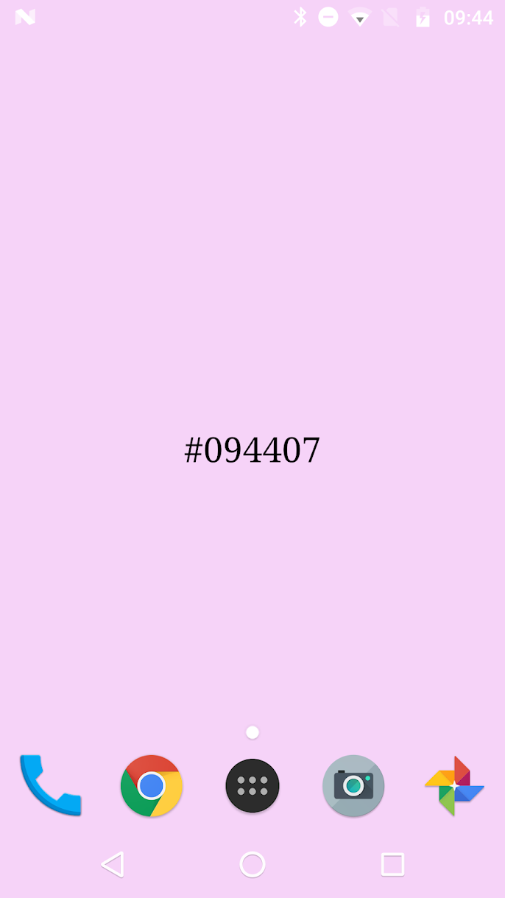
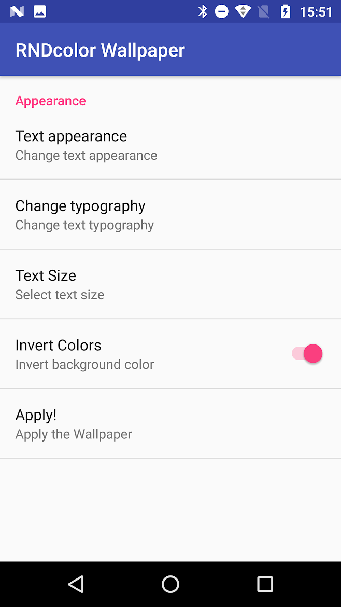
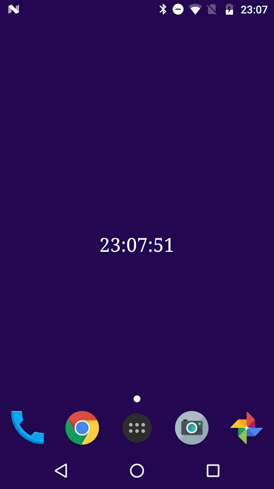

# Random Color Live Wallpaper

Solid color wallpaper that changes color (animates), for Android.

Uses current time in format hh:mm:ss as hex color code to change a solid color wallpaper every second. Has several display options and an invert color option.

This is pre-alpha because additional functionality is planned. Here is the [https://github.com/earthbound19/random-color-live-wallpaper-android/projects/1](project board).

## Features
* Three text appearances: time (20:21:23), hex color (#202123) or no text
* Change typography (Default, Default Bold, Monospace, Sans Serif or Serif)
* Change text size
* Invert colors

## Screenshots

## License

[GPLv3](https://www.gnu.org/licenses/gpl-3.0.en.html) license

This is a fork of the free and open source app [HexColorTime](https://f-droid.org/app/com.eneko.hexcolortimewallpaper) (for which here is a link to [the source repo](https://github.com/urtxintxa/HexColorTime)).

